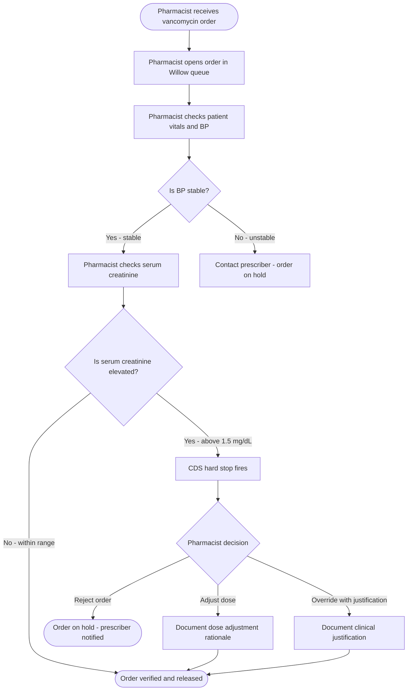

```mermaid
flowchart TD
    A([Pharmacist receives vancomycin order]) --> B[Pharmacist opens order in Willow queue]
    B --> C[Pharmacist checks patient vitals and BP]
    C --> D{Is BP stable?}
    D -->|Yes - stable| E[Pharmacist checks serum creatinine]
    D -->|No - unstable| F[Contact prescriber - order on hold]
    E --> G{Is serum creatinine elevated?}
    G -->|No - within range| H([Order verified and released])
    G -->|Yes - above 1.5 mg/dL| I[CDS hard stop fires]
    I --> J{Pharmacist decision}
    J -->|Adjust dose| K[Document dose adjustment rationale]
    J -->|Reject order| L([Order on hold - prescriber notified])
    J -->|Override with justification| M[Document clinical justification]
    K --> H
    M --> H
```
